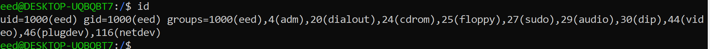
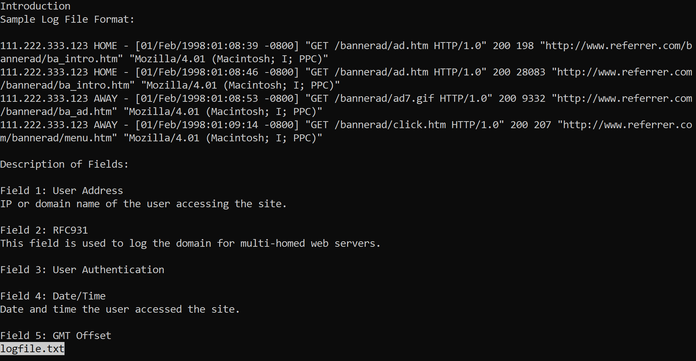
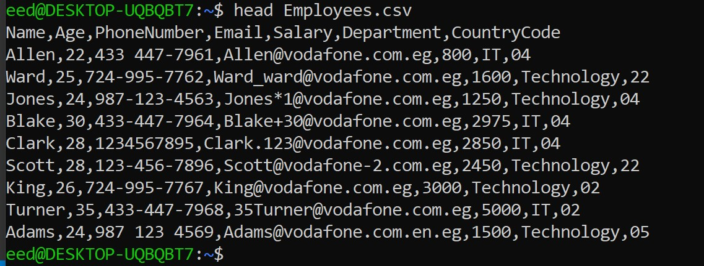
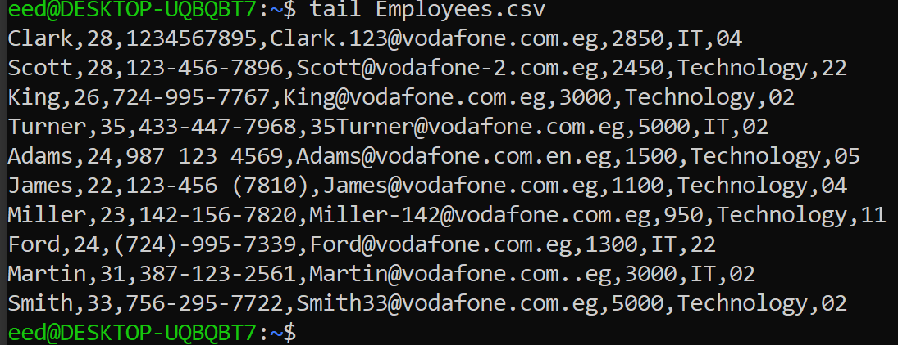

# Linux Cheat sheet

| Command | Use | example|
| ------ | ------ |------|
| [cd](#cd)  | change directory | cd / |
| [pwd](#pwd) |print working directory| pwd|
|  [man](#man) | open manual page for a command | man cd |
|[whoami](#whoami)| Print the user name associated with the current effective user ID |
| [id](#id) | Print user and group information for each specified USER |
|  [hostname](#hostname) | display the system's DNS name |
|  [uptime](#uptime) | gives  a  one  line display of the following information |
|  [date](#data) | gives  a  one  line display of the following information |
|  [cal](#cal) | displays a simple calendar in traditional format and ncal offers an alternative layout |
|  [clear](#clear) | clears your screen if this is possible |
|[echo](#echo) | displays information on the console |echo HI
| [history](#history) | views the history file| history
| [touch](#touch) | update the access and modification times of each file to current time | touch file
| [cat](#cat) | reads data from the file and provides the content as output within the terminal window | cat|  
|[ls -l](#ls-l)   | list the content of the current folder  | |
| [find](#find)  | searches a desgnated directory for files that match specific criteria |  |
| [useradd](#useradd) | creats the user accounts  | |
| [grep](#grep) | defines account | grep fail /var /log/secure |
| [usermod](#usermod) | modify or change parts of or a whole existing user account | |
| [userdel](#userdel) | delets a user account | userdel -r to also delete the user's home directory
| [passwd](#passwd) | changing password for user  | |
| [groupadd](#groupadd) | creats a new group | groupadd group |
| [groupmod](#groupmod) | modifies an existing group | groupmod -n new_group old_group |
| [groupdel](#groupdel) | deletes an existing group | groupdel group |
| [su](#su) | allows commands to be run with a  itute user and group ID | |
| [sudo](#sudo) | delegate a specific administrative task to a specific standard user | |
| [ls](#ls) | displays a list of files in a directory | |
| [more](#more) | viwe file contents that don't fit on one screen | |
| [less](#less) | displays file contents that don't fit on one screen | |
| [head](#head) | displays the first 10 lines of a file by default | |
| [tail](#tail) | displays the last 10 lines of file by default | |
| [cp](#cp) | copies files and directories | |
| [rm](#rm) | deletes files | rm filel.txt |
| [mkdir](#mkdir) | creates new directories | mkdir documents |
| [mv](#mv) | moves a file from one dirctory to another | mv files.txt.backup ~/backups |
| [rmdir](#rmdir) | deletes existing empty directories | rmdir decuments |
| [hash](#hash) | displays a list of recently run programs, their location, and the number of times they have run| hash |
| [cksum](#cksum)  | see whether the file was corrupted during transfer | cksum userdata.txt |
| [diff](#diff) | compares files line by line and displays the differences | diff cities.txt cities2.txt |
| [tar](#tar) | created bundel is called a tarball | tarfile.tar |
| [gzip](#gzip) | compresses files, including tarballs | gizp salesdata.tar |
| [ln](#ln) | syntax for creating a hard link | |
| [chown](#chown) | changes the user and/or group ownership of each given file | |
| [chmod](#chmod) | sets permissions on files | |
| [cut](#cut) | displays that information to standard output | |
| [sed](#sed) | edits data based on the rules are provide  | sed 's/page/website/' example . txt | 
| [sort](#sort) | sorts file contents in a specified order | sort file.txt |
| [awk](#awk) | write small programs to transform data |  |
|[ps](#ps) |list running processes|  ps -ef |
|[pidof](#pidof)|list the process by is ||
|[pstree](#pstree)|list running processes in a tree format|pstree -p|
|[top](#top)|shwo real time statistics of system "task manager"||
|[kill](#kill)|kill the process usign id |kill -9 10|
|[nice](#nice)|adjust the processs priotiy|nice -5 bash|
| [at](#at) | runs a task once at a specified time  | |
| [cron](#cron) | run a task on a regular basis at a specified time | |
| [crontab](#crontab) | holds the commands and steps that the cron daemon will run | crontab -a filename |
| [fg](#fg) | move a process to foreground | fg%jobnumber |
|[bg](#bg)|move a process to background|bg %jobnumber|
|[systemctl](#systemctl)|  introspect and control the state of the "systemd" system and service manager ||
|[lscpu](#lscpu)|  list CPU information ||
|[lshw](#lshw)| is a small tool to extract detailed information on the hardware configuration of the  machine ||
|[du](#du)| directory usage||
|[df](#df)|directory free||
|[vmstat](#vmstst)|virtual memory statistics||
|[free](#free)|usage of physical memory||
|[env](#env)|   Set each NAME to VALUE in the environment and run COMMAND | |
| [lastlog](#lastlog) | reports recent login information for the system | |
| [exit](#exit) | causes script to stop running and exit to the shell if the previous portion fails | |
| [read](#read) | read user input into a script | |
| [aliases](#aliases) |you can define new commands by substituting a long command with a short one||
|[yum](#yum) |||

## cd 
change directory

``` 
cd /
```


## pwd 
print working directory

``` 
pwd
```


## man
 open manual page for a command 

``` 
man man
```


## whoami
 Print the user name associated with the current effective user ID

``` 
whoami
```


## id
 Print user and group information for each specified USER

``` 
id
```


## hostname
 display the system's DNS name

``` 
hostname
```


## uptime
gives  a  one  line display of the following

``` 
uptime 
```


## date 
 gives  a  one  line display of the following 

``` 
date 
```


## cal 
 displays a simple calendar in traditional format and ncal offers an alternative layout

``` 
cal 
```


## clear
clears your screen if this is possible
```
clear
```


## echo
displays information on the console 
```
echo "this is echo command"
```


## history
 views the history file
```
history
```


## touch
 update the access and modification times of each file to the current time
```
touch file.txt
```


##  cat
 reads data from the file and provides the content as 
```
 cat logfile.txt
```


## ls-l
list the content of the current folder 
```
ls -l
```


## find
 searches a desgnated directory for files that match 
```
find
```


## useradd
 creats the user accounts 
```
sudo useradd mazen
```


## grep
 defines account | grep fail /var /log/secure
```
grep -i field logfile.txt
```


## usermod
 modify or change parts of or a whole existing user 
```
sudo usermod -c "this is CTO" mazen
```


## userdel
 delets a user account | userdel -r to also delete the 
```
sudo userdel mazen
```


## passwd
 changing password for user 
```
sudo passwd ali
```


## groupadd
 creats a new group | groupadd group 
```
sudo groupadd ahmed
```


## groupmod
 modifies an existing group | groupmod -n new_group 
```
sudo groumod -n business ahmed
 ```


## groupdel 
 deletes an existing group | groupdel group 
```
sudo groupdel bussiness
```


## su 
 allows commands to be run with a substitute user and group 
```
sudo su
```


## sudo 
 delegate a specific administrative task to a specific 
```
sudo 
```


## ls
displays a list of files in a directory 
```
ls
```


## more
 viwe file contents that don't fit on one screen 
```
 more logfile.txt
```


## less
 displays file contents that don't fit on one screen
```
less
```



## head 
 displays the first 10 lines of a file by default 
```
head logfile.txt
```


## tail 
 displays the last 10 lines of file by default
```
 tail logfile.txt
```


## cp
 copies files and directories 
```
cp logfile.txt new_dir/
```


## rm
 deletes files 
```
rm file1.txt
```


## mkdir
creates new directories 
```
mkdir file2
```


## mv
moves a file from one dirctory to another 
```
mv file2 mazen
```


## rmdir
 deletes existing empty directories 
```
rmdir new_dir
```


## hash
displays a list of recently run programs, their location, and the number of times they have run
```
hash
```


## cksum 
 Print CRC checksum and byte counts of each FILE.
```
cksum logfile.txt
```


## diff
compares files line by line and displays the differences 
```
diff file1 file2
```


## tar
created bundel is called a tarball 
```
tar
```


## gzip
 compresses files, including tarballs
```
gzip logfile.txt
```


## ln
syntax for creating a hard link 
```
ln
```


## chown
changes the user and/or group ownership of each given file
```
chown
```


## chmod
change file mode bits
```
chmod
```


## cut 
displays that information to standard output
```
cut 
```


## sed
edits data based on the rules are provide 
```
sed
```


## sort
 sorts file contents in a specified order
```
sort logfile.txt
```


## awk
 write small programs to transform data
```
awk
```


## ps
list running processes
```
ps
```


## pidof
find the process ID of a running program.   
```
pidof bash
```


## pstree
list running processes in a tree format
```
pstree
```


## top
 shwo real time statistics of system "task manager"
```
top -hv
```


## kill
kill the process usign id
```
kill
```


## nice
adjust the processs priotiy
```
nice
```


## at
runs a task once at a specified time
```
at
```


## cron 
run a task on a regular basis at a specified time
```
cron
```


## crontab
holds the commands and steps that the cron daemon will run 
```
crontab
```


## systemctl
introspect and control the state of the "systemd" system and service manager
```
systemctl
```


## lscpu
list CPU information
```
lscpu
```


## lshw
 is a small tool to extract detailed information on the hardware configuration of the  machine 
```
lshw
```


## du
directory usage
```
du
```


## df
directory free
```
df
```


## vmstat
virtual memory statistics
```
vmstat
```


## free
freusage of physical memory
```
free
```


## env
 Set each NAME to VALUE in the environment and run COMMAND
```
env
```


## exit
causes script to stop running and exit to the shell if the previous portion fails
```
exit
```


## read
read user input into a script
```
read
```


## lastlog
 reports recent login information for the system
```
lastlog
```


## aliases
 you can define new commands by substituting a long command with a short one
```
aliases
```


# Bash shell

### shell variables
```
name=value
```
### displaying shell variables
```
# echo $user
```
```
# echo $home
```
```
# echo $shell
```
### environment variables
```
key=value
```
### common environment variables
```
echo $variable-name
```
### the env command 
```
env XDG-VTNR
```
```
env XDG-SESSONS-ID
```
```
env HOSTNAME
```
```
env SHELL
```
```
env TERM
```
### shell scripts
```
echo "hello $USER!"
```
```
echo "today's data is : data"
```
### the # character 
```
# this is a comment
```
```
# echo "this line will be ignored"
```
### # bin/bash and #comments
```
# !/bin/bash
```
### declare a bash variable
```
NAME="mary major"
```
### operators
```
# !/bin/bash

sum=$(($1 + $2))
echo $1 + $2 equals $sum
```
### expressions
```
sum=$(($1 + $2))       
```
### conditional statements 
```
# !/bin/bash  
#copy file to /tmp
# delete file1 if the copy was successful

if [ cp file1 /tmp ];
then
       rm file1
fi
```     
### the if statement 
```
# !/bin/bash  
#copy file to /tmp
# delete file1 if the copy was successful

if [ cp file1 /tmp ];
then
       rm file1
fi
```
### the if - elif - else statement
```
# !/bin/bash
#compares $1 and $2
if [$1 -gt $2];
then
       echo "the first number is greater then the second number"
elif [$1 -lt $2];
then
       echo "the second number is greater then the first number"    
else
       echo "the two numbers are equal"
fi
```
### lnteger comparison operators 
```
 if ["$1" -gt "$2"];
 then 
            echo "..."
fi
```
```
 if (("$1">"$2"))
 then 
            echo "..."
fi
```
```
 if [[ $1 -gt $2]]
 then 
            echo "..."
fi
```
```
 if [$1 -gt $2]
 then 
            echo "..."
fi
```
```
 if (($1>$2));
 then 
            echo "..."
fi
```
### string comparison operations example
```
#!/bin/bash
#compares letters $1 and $2

if ["$1" == "$2"];
then
        echo "letters are the same"
 elif [$1 \< $2]; 
 then 
        echo " the first letter is brfore the second letter"       
else
        echo "the second letter is before the first letter"
```
### the for statement 
```
#!/bin/bash
#the for loop

for x in 1 2 3 4 5 a b c d 
do
       echo "the value is $x"
done
```
### the while statement 
```
#!/bin/bash
#the while loop

counter=1
while  [$counter -le 10];
do
        echo  $counter
        ((counter++))
        if  [counter == $1];
        then
              break
        fi
done
echo "loop exited"
echo "counter equals $counter"              
```
### the until statement
```
#the until loop

counter=1
while  [$counter -le 10];
do
        echo  $counter
        ((counter++))
        if  [counter == $1];
        then
              break
        fi
done
echo "loop exited"
echo "counter equals $counter"              
```
### loop control statments
```
#the break loop

counter=1
while  [$counter -le 10];
do
        echo  $counter
        ((counter++))
        if  [counter == $1];
        then
              break
        fi
done
echo "loop exited"
echo "counter equals $counter"              
```
```
#the continue loop

counter=1
while  [$counter -le 10];
do
        echo  $counter
        ((counter++))
        if  [counter == $1];
        then
              break
        fi
done
echo "loop exited"
echo "counter equals $counter"              
```
### the true and false commands
```
#!/bin/bash
#the infinity loop

while true
do
              echo "loops forever"
done
```
```
#!/bin/bash
#the while loop
#the break statement

counter=1
while  [$counter -le 10];
do
         echo $counter
         ((counter++))
done
```
### the exit command 
```
  #!/bin/bash

  touch myfile.txt
  if [ $? -eq 0];
  then
          echo "file created"
          exit 0
  else
  do   
           echo "error when creating the file"
           exit 1
 ```
### command substitution (review)
```
#!/bin/bash

echo "hello $user!"
echo "today's data is : data "
```
### arguments 
``` 
#!/bin/bash

sum=$(($1+$2))
echo $sum
```
### the read command
```
#!/bin/bash

echo " hello what is your name ? "
read VARNAME
echo "glad to meet you , $VARNAME"
```


